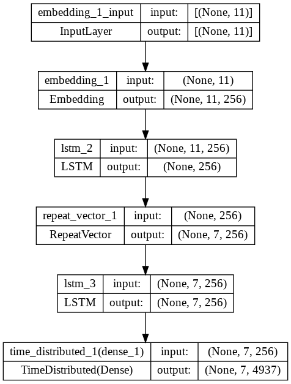

# Translation-Model
it is a model to translate from Germany to English using LSTM.

# Dataset
it is in the deu file.
get dataset from ==> https://raw.githubusercontent.com/jbrownlee/Datasets/master/deu.txt .
description of dataset ==> https://github.com/jbrownlee/Datasets/blob/master/deu.names .

the dataset is consist of 150,000 phrase pairs. i used 20000 for train and 10000 for test.

# Model
<h1 align="center">

</h1>

# Results
# BLEU SCORES
Train: BLEU-1: 0.840214 /n
       BLEU-2: 0.771045
       BLEU-3: 0.722561
       BLEU-4: 0.582174
       
Test: BLEU-1: 0.549659
      BLEU-2: 0.418792
      BLEU-3: 0.360866
      BLEU-4: 0.235495
